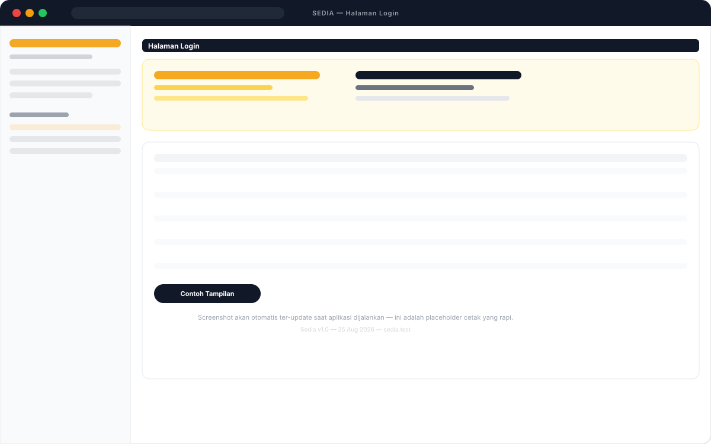
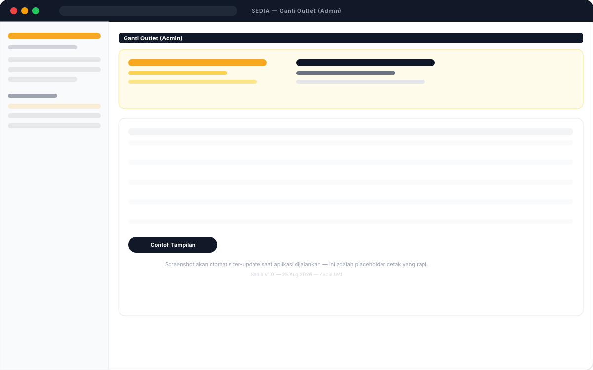
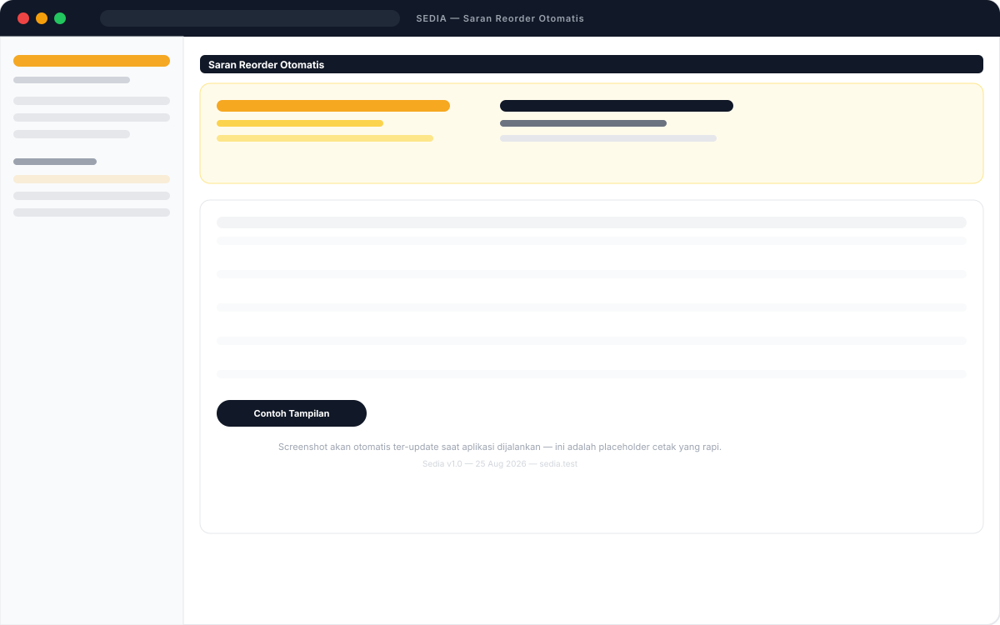

# 📘 User Manual — Sedia

**Sistem Manajemen Outlet, Persediaan & Penjualan**
Versi 1.0 — 25 Agustus 2026 | Untuk: Admin & Staff/Kasir (User Awam)

> **Cara pakai manual ini:** Buka daftar isi, klik judul. Ikuti langkah bernomor. Jika bingung, lihat bagian **FAQ** di akhir. Manual ini juga bisa dibuka di browser: `http://alamat-aplikasi/manual` → tombol **Cetak / Simpan PDF**.

---

## Daftar Isi
1. [Tentang Sedia](#1-tentang-sedia)
2. [Peran Pengguna](#2-peran-pengguna)
3. [Login, Logout & Ganti Outlet](#3-login-logout--ganti-outlet)
4. [Mengenal Dashboard](#4-mengenal-dashboard)
5. [Penjualan — POS Kasir (Paling Sering Dipakai)](#5-penjualan--pos-kasir)
6. [Transaksi Penjualan & Void](#6-transaksi-penjualan--void)
7. [Tutup Kasir Harian](#7-tutup-kasir-harian)
8. [Produk — Bahan Baku & Menu](#8-produk--bahan-baku--menu)
9. [Persediaan — Stok](#9-persediaan--stok)
10. [Operasional — Karyawan, Kasbon, Gaji](#10-operasional--karyawan-kasbon-gaji)
11. [Laporan](#11-laporan)
12. [Pengaturan — Pengguna, Outlet & Log Aktivitas](#12-pengaturan)
13. [Notifikasi](#13-notifikasi)
14. [Instal di HP/Laptop (PWA)](#14-instal-di-hplaptop-pwa)
15. [Alur Kerja Harian (SOP)](#15-alur-kerja-harian-sop)
16. [FAQ & Troubleshooting](#16-faq--troubleshooting)

---

## 1. Tentang Sedia

**Sedia** adalah aplikasi untuk mengelola **banyak outlet** dalam satu tempat:
- Kasir/POS ringan yang potong stok otomatis
- Stok bahan baku per outlet (transfer antar outlet, stock opname)
- Karyawan, kasbon, dan penggajian
- Laporan penjualan, pemakaian bahan, laba per menu, & gaji

**Warna & Navigasi:** Sidebar kiri dibagi grup: **Penjualan**, **Produk**, **Persediaan**, **Operasional**, **Laporan**, **Pengaturan**. Tombol utama berwarna **Amber (kuning-oranye)**.

---

## 2. Peran Pengguna

| Peran | Akses | Contoh |
|-------|-------|--------|
| **Admin** | Semua outlet, bisa ganti outlet di pojok atas, bisa kelola Pengguna/Outlet/Menu/Bahan, bisa Void & Approve Kasbon | Owner, Manager |
| **Staff / Kasir** | Hanya outlet sendiri (terkunci), bisa: POS, lihat stok outlet sendiri, ajukan kasbon, lihat laporan outlet sendiri | Kasir, Crew |

> **Penting:** Staff tanpa outlet tidak bisa lihat data apapun — hubungi Admin untuk dihubungkan ke outlet.

---

## 3. Login, Logout & Ganti Outlet

### Login
1. Buka alamat aplikasi → halaman **Login**.
2. Masukkan **Email** & **Password** → **Masuk**.
3. Jika salah, akan ada pesan “Email atau password salah”.

### Ganti Outlet (khusus Admin)
1. Di **pojok atas** ada dropdown **Outlet: Semua Outlet ▼**.
2. Pilih outlet → otomatis filter seluruh halaman ke outlet tersebut.
3. Pilih **Semua Outlet** untuk lihat gabungan.

### Logout
Klik avatar di pojok kanan atas → **Keluar**.

---

## 4. Mengenal Dashboard

Setelah login, kamu di **Dashboard** (`/dashboard`):
- **Kartu Omzet Hari Ini / Bulan Ini** — ringkasan penjualan selesai.
- **Grafik Tren 7 Hari** — garis omzet harian.
- **Tabel Stok Kritis** — bahan di bawah `Min. Stock` (perlu reorder).
- **Notifikasi (lonceng)** — di kanan atas, untuk Kasbon baru, dll.

> **Tips:** Admin lihat semua outlet; Staff hanya outlet sendiri.

---

## 5. Penjualan — POS Kasir

Ini halaman yang paling sering dipakai kasir. Buka **Penjualan → POS Kasir** (`/dashboard/pos`).

### Tampilan POS

### Langkah Transaksi
1. **Pilih Outlet** (Admin saja) — pastikan outlet benar.
2. **Pilih Metode Bayar** — pill **Tunai / QRIS / Transfer / Debit**.
3. **Cari Menu** — ketik di “Cari menu” atau pilih **pil Kategori** (Semua, Ayam, Minuman…).
4. **Tap Kartu Menu** — misal “Ayam Original — Rp 25.000” → masuk keranjang. Tap lagi untuk tambah qty.
5. **Atur Keranjang (kanan):**
   - `−` / `+` untuk kurangi/tambah
   - `hapus` untuk hapus baris
   - `Kosongkan` untuk kosongkan semua
6. **Cek Total** — kotak “Total bayar” (misal Rp 75.000, 3 item).
7. **Bayar** — transaksi **Completed**, stok bahan otomatis terpotong sesuai resep. Jika stok bahan kurang, muncul notifikasi **“Stok tidak cukup”** dan transaksi **dibatalkan semua** (tidak setengah jadi).
8. Setelah sukses, keranjang kosong & muncul notifikasi “Transaksi berhasil”.

> **Catatan Stok:** Harga & subtotal diambil dari **Master Menu** di server, bukan dari yang kamu ketik — jadi tidak bisa di-tamper via browser.

### Tips POS
- POS bisa di-instal sebagai aplikasi HP (lihat bab PWA).
- Jika salah input, jangan edit qty di transaksi langsung — **hapus item lalu tambah lagi** (agar stok konsisten).

---

## 6. Transaksi Penjualan & Void

Buka **Penjualan → Transaksi Penjualan**.

### Melihat Daftar
- Kolom: Waktu, Invoice, Outlet, Kasir, Item, Total, Bayar, Status (`Selesai` hijau / `Batal` merah).
- Filter: Outlet, Status, Metode Bayar. Gunakan **Search** untuk cari Invoice.
- Klik **Mata (View)** untuk detail.

### Membuat Transaksi Manual (alternatif POS)
1. **Tambah** → isi Outlet, Kasir, Invoice (auto), Waktu, Metode Bayar, Status `Selesai`.
2. Di **Item Pesanan** → tambah baris, pilih Menu, isi Qty → Harga & Subtotal otomatis. Preview Total di atas.
3. **Simpan** → sama seperti POS, stok terpotong.

### Membatalkan (Void) — Hanya Admin
1. Cari transaksi `Selesai` → tombol **Batalkan** (ikon X merah) muncul hanya untuk Admin.
2. Konfirmasi → stok bahan **dikembalikan persis** sesuai yang terpotong, status jadi `Batal`.
3. Bulk: centang beberapa baris → **Batalkan terpilih** (atas tabel).

### Cetak Struk
- Di tabel transaksi → **Struk** (ikon printer) → buka di tab baru, ukuran **80mm** siap cetak thermal.
- Tombol **Cetak / Simpan PDF** di struk.

---

## 7. Tutup Kasir Harian

Buka **Penjualan → Tutup Kasir Harian** (`/dashboard/tutup-kasir-harian`).

1. Pilih **Tanggal** (default hari ini) & **Outlet** (admin).
2. Klik **Tampilkan**.
3. Lihat **KPI**: Total Transaksi, Total Omzet, Tunai, Non-Tunai.
4. Tabel **Rincian per Kasir**: columns Transaksi, Tunai, Transfer, QRIS, Debit, Total.
5. **Cetak** untuk arsip harian (print A4, header outlet + tanggal + jam cetak).

> Gunakan setiap tutup shift untuk cocokkan uang tunai di laci vs “Tunai” di laporan.

---

## 8. Produk — Bahan Baku & Menu

### Bahan Baku (`Persediaan → Bahan Baku`)
- **Hanya Admin** bisa tambah/edit. Staff hanya lihat.
- Field: Nama, Satuan (kg/gram/liter/ml/pcs/porsi), **Harga beli / unit** (dipakai hitung HPP), **Min. Stock** (batas reorder), Aktif.
- Jika `Harga beli` belum diisi, laporan Laba akan 0.

### Menu (`Produk → Menu`)
- **Hanya Admin**.
- Field: Nama, Kategori, Harga Jual, Aktif.
- **Resep:** Buka menu → tab **Resep** → tambah bahan + `Qty per unit` (misal Ayam Original pakai Ayam 0.25 kg + Bumbu 0.02 kg). Ini yang dipakai potong stok saat terjual.

---

## 9. Persediaan — Stok

### Saldo Stok (`Persediaan → Saldo Stok`) — Read-only
- Menampilkan `Outlet × Bahan` + `Quantity`. Tidak bisa diedit manual — hanya lewat Transaksi, Transfer, atau Opname.

### Transfer Stok (`Persediaan → Transfer Stok`)
**Skenario A: Transfer antar outlet**
1. **Tambah** → Sumber `Transfer antar outlet`, **Dari Outlet** (auto outlet kamu jika staff), **Ke Outlet** (pilih, tidak boleh sama, harus aktif), Waktu Kirim.
2. Tab **Item Transfer** → **Tarik Semua Item** atau **Tambah** manual → isi Qty (cek Stok Tersedia).
3. Simpan sebagai `Draft` → **Kirim** (potong stok asal, status `Dikirim`/`sent`).
4. Di outlet tujuan → **Terima** (tambah stok tujuan, status `Diterima`/`received`).

**Skenario B: Belanja dari Stockist**
- Sumber `Belanja dari stockist` → tidak ada Dari Outlet, langsung `Diterima` (hanya `TransferIn`).

**Batalkan:** `Draft`/`Dikirim` bisa **Batalkan** → jika sudah `Dikirim`, stok dikembalikan ke asal. Hanya Admin atau pemilik outlet asal. Bulk cancel tersedia.

### Stock Opname (`Persediaan → Stock Opname`)
- Untuk cocokkan fisik vs sistem.
1. **Tambah** → Outlet, Tanggal, Petugas, Catatan → `Draft`.
2. Tab **Item Opname** → pilih Bahan → `Qty Sistem` terisi otomatis (disabled), isi `Qty Aktual (fisik)`.
3. Atau **Tarik Semua Item** → isi Aktual massal → Simpan.
4. **Terapkan** → selisih `Aktual - Sistem` dicatat sebagai `OpnameAdjustment` (tambah/kurang stok), status jadi `Diterapkan`. Setelah diterapkan, item & form terkunci (tidak bisa edit). Bulk edit di-block.

### Saran Reorder (`Persediaan → Saran Reorder`)
- Otomatis hitung dari **pemakaian 30 hari** (penjualan + expired/reject + transfer keluar).
- Rumus: `Target = Min Stock + (Rata/hari × 7)` → `Saran = max(0, Target - Stok Saat Ini)`.
- Hanya tampil bahan yang perlu reorder. Filter Outlet. Tombol **Cetak**. Jika “Semua stok aman” → tidak ada saran.

---

## 10. Operasional — Karyawan, Kasbon, Gaji

### Karyawan (`Operasional → Karyawan`)
- Staff bisa lihat outlet sendiri; **Gaji Pokok hanya Admin** bisa edit.
- `Outlet` terkunci untuk staff (validasi server cegah pindah outlet via tamper).

### Kasbon (`Operasional → Kasbon`)
- **Staff: Ajukan** → Outlet auto, pilih Karyawan aktif, Nominal, Tanggal, Catatan → status **Pending** (default).
- **Admin: Setujui/Tolak** → di tabel ada tombol **Setujui** (hijau) / **Tolak** (merah) hanya untuk `Pending`. Bulk approve/reject juga ada. Setelah `Disetujui/Ditolak`, hanya Admin bisa lihat (staff tidak bisa edit lagi).
- Notifikasi lonceng ke Admin saat ada kasbon baru; notifikasi ke pengaju saat diputus.

### Penggajian (`Operasional → Penggajian`) — Admin Only untuk buat
- **Hanya Admin** bisa buat. Staff bisa lihat outlet sendiri tapi tidak bisa buat/edit `paid`.
- Field: Outlet, Karyawan, Tanggal Gajian, Periode Mulai/Akhir, Gaji Pokok, Bonus Masuk/Goreng, **Kasbon** (potongan periode ini). Preview Total = `Pokok + Bonus Masuk + Bonus Goreng - Kasbon`. Nilai final disimpan server (anti-tamper, termasuk bulk).
- Status `Draft / Dibayar / Dibatalkan`. Jika `Dibayar`, form terkunci & tidak bisa diedit (must void via hapus oleh Admin).
- **Saldo Kasbon Berjalan** di laporan `Gaji & Kasbon` = `Total Kasbon Disetujui - Total Gaji (gaji) - Total Potongan Payroll Dibayar` (sudah termasuk).

---

## 11. Laporan

Buka **Laporan** (6 laporan). Semua punya **Filter Tanggal & Outlet** (Admin semua, Staff terkunci). Ada **KPI** di atas tabel + **Cetak** (print A4 dengan header: App, Judul, Outlet, Periode, Jam Cetak).

| Laporan | Isi | Filter |
|---------|-----|--------|
| **Penjualan per Outlet** | Rincian per outlet: Jml Transaksi, Total Omzet, Rata-rata | Tanggal, Outlet |
| **Menu Terlaris** | Ranking menu: qty terjual, kategori, omzet | Tgl, Outlet |
| **Pemakaian Bahan Baku** | Per bahan: Terpakai (penjualan), Rusak/Expired, Transfer Keluar, Total, Estimasi Nilai | Tgl, Outlet |
| **Selisih Stock Opname** | Per bahan: Jml Opname, Selisih Bersih (±), Total Absolut — merah kurang, hijau lebih | Tgl, Outlet |
| **Gaji & Kasbon** | Atas: Rekap Gaji Dibayar per outlet (pokok/bonus/potongan/total). Bawah: Saldo Kasbon Berjalan | Tgl, Outlet |
| **Laba Kotor per Menu** | Per menu: Harga Jual, HPP/unit, Margin/unit, Qty, Omzet, Laba Kotor, Margin % | Tgl, Outlet |

> HPP = sum(resep `qty_per_unit × cost_per_unit`). Jika HPP 0 semua, isi dulu Harga Beli di Bahan Baku.

---

## 12. Pengaturan

### Pengguna (`Pengaturan → Pengguna`) — Admin Only
- Kelola akun login: Nama, Email, Password, Role (Admin/Staff), Outlet (wajib untuk Staff). Staff tidak bisa akses halaman ini (403).

### Outlet (`Pengaturan → Outlet`) — Admin Only
- Master outlet: Nama, Alamat, Telepon, Aktif.

### Log Aktivitas (`Pengaturan → Log Aktivitas`) — Admin Only, Read-only
- Jejak audit otomatis: `created/updated/deleted/voided/approved/rejected/cancelled/sent/received` untuk Sales, Kasbon, Payroll, Transfer, Opname, Menu, Bahan, User, Outlet, Karyawan. Filter Aksi & Outlet. Bulk delete (admin). Tanpa edit.

---

## 13. Notifikasi

Ikon **lonceng** di topbar kanan. Muncul saat:
- Kasbon baru `Pending` (ke Admin)
- Kasbon `Disetujui/Ditolak` (ke pengaju)
- (Siap dipakai untuk event lain: transfer, void, dll.)

Klik lonceng → daftar → **Tandai sudah dibaca**.

---

## 14. Instal di HP/Laptop (PWA)

POS bisa jadi aplikasi:

**Di Chrome / Edge HP:**
1. Buka `/dashboard/pos` → menu ⋮ → **Instal aplikasi** / **Tambahkan ke Layar Utama**.
2. Ikon **Sedia** muncul di home screen, buka seperti app native, tanpa address bar.

**Di Laptop Chrome/Edge:**
- Icon instal di address bar → **Instal**.

Syarat: akses via **HTTPS** (di Vercel sudah). Service worker cache build asset (`/build/*`), halaman Livewire tetap fresh.

---

## 15. Alur Kerja Harian (SOP)

**Pagi (Admin):**
1. Cek **Saran Reorder** → belanja jika ada.
2. Cek **Stok Kritis** di Dashboard.

**Shift Kasir (Staff):**
1. Login → pastikan Outlet benar (pojok atas).
2. Jualan via **POS Kasir** → **Bayar**.
3. Jika salah: jangan edit transaksi `Selesai` — minta Admin **Void** lalu buat baru.
4. Kasbon? **Operasional → Kasbon → Ajukan** (Pending).

**Tutup Shift:**
1. **Tutup Kasir Harian** → pilih tanggal & outlet → cocokkan Tunai di laci vs Tunai di laporan.
2. **Cetak** untuk arsip.

**Mingguan (Admin):**
1. **Stock Opname** → Tarik Semua Item → hitung fisik → Terapkan.
2. **Penggajian** → buat draft → cek potongan kasbon → set Dibayar.

---

## 16. FAQ & Troubleshooting

**Q: Staff lihat semua outlet?**
A: Cek `User → outlet_id` harus terisi. Jika kosong, staff akan lihat 0 data (fixed). Hubungi Admin.

**Q: “Stok tidak cukup” saat jual di POS?**
A: Kurangi qty atau tambah stok via Transfer/Purchase/Opname. Stok dipotong per-resep, bukan per-menu.

**Q: Transaksi double terpotong?**
A: Sudah di-fix dengan `lockForUpdate` & validasi status. Jika masih, cek apakah ada 2 kasir tap bersamaan — sistem sekarang tolak yang kedua.

**Q: Harga bisa diubah via browser?**
A: Tidak. Server paksa `price = Menu.price` & `subtotal = price×qty` di `SalesTransactionItemObserver`.

**Q: Tidak bisa instal PWA?**
A: Harus HTTPS & `manifest.json` ada. Di Vercel sudah. Coba Chrome, bukan Firefox Focus.

**Q: Laporan kosong?**
A: Periksa filter tanggal & outlet. Jika outlet “Semua” tapi kamu Staff, tetap filter ke outlet kamu.

**Butuh bantuan?** Hubungi Admin. Untuk bug teknis, sertakan **waktu, outlet, invoice, screenshot**.

---

*© 2026 Sedia — Manual ini bisa dicetak: buka `/manual` → Ctrl+P → Simpan sebagai PDF.*

